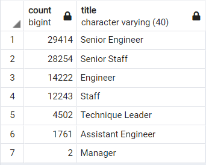
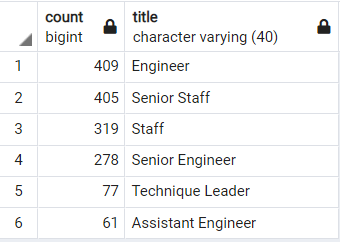
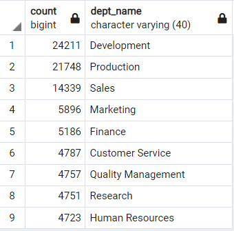
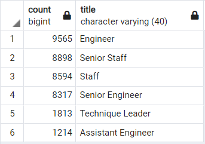

# Pewlett_Hackard_Analysis

## Project Overview

The following analysis of Pewlett Hackard human resources data was performed to provide further insight into the upcoming "silver tsunami".
 
1. The total number of employees approaching retirement by title.
2. The number employees who are eligible to participate in a mentorship program.

## Resources 

- Software: PostgreSQL 12, pgAdmin 4.28
- SQL Tables & Queries: [Employee_Database_challenge](Queries/Employee_Database_challenge.sql)

## Results

### 1. [Total Employees Retiring by Title](Data/unique_titles.csv)

- The calculation for employees approaching retirement is based on birthdates between **January 01, 1952 - December 31, 1955**

<kbd><kbd>

### 2. [Employees Eligible for the Mentorship Program](Data/mentorship_eligibility.csv)

- Mentorship program eligibility is based on employees born between **January 01, 1965 - December 31, 1965**

<kbd><kbd>

Based on the results we can determing the follwing:

- A total of **90,398**  employees will be approaching retirement. 
- Approximately **63.8%** off employees approaching retirement are in *Senior Roles*.
- Approximately **48.3%** of the employees approaching retirement are in *Engineering Roles*.
- A total of **1,549** employees are eligible to participate in the mentorship program.  

## Summarry 

1. As the "Silver Tsunami" begins to make an impact, approximately 90,398 employees will be approaching retirment. To help better prepare for the upcoming wave, Pewlett Hackard may also want to consider providing this data to managment for the impacted departments. 

- Employees approaching retirement by **Department**

<kbd><kbd>

2. Based on the current criteria for the mentorship program, there are only 1,549 employyes that qualify. Pewlett Hackard may want to consider expanding the criteria for eligiblity to allow for additional employees to mentor the next Generation.

- Mentorship program eligibility is based on employees born between **January 01, 1963 - December 31, 1965**

<kbd><kbd>
